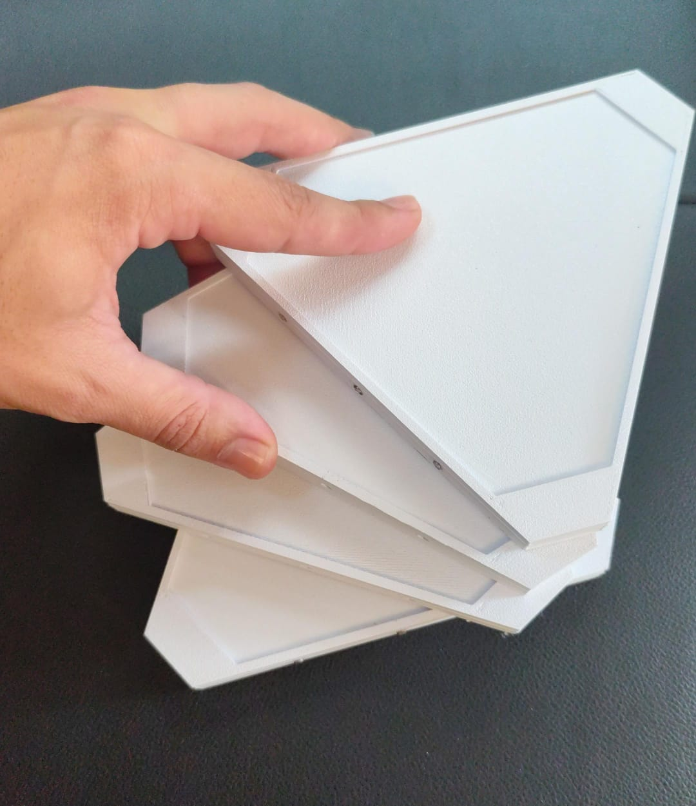
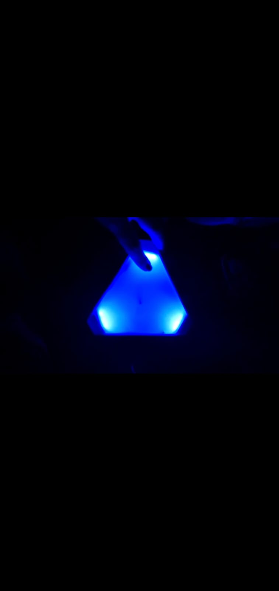
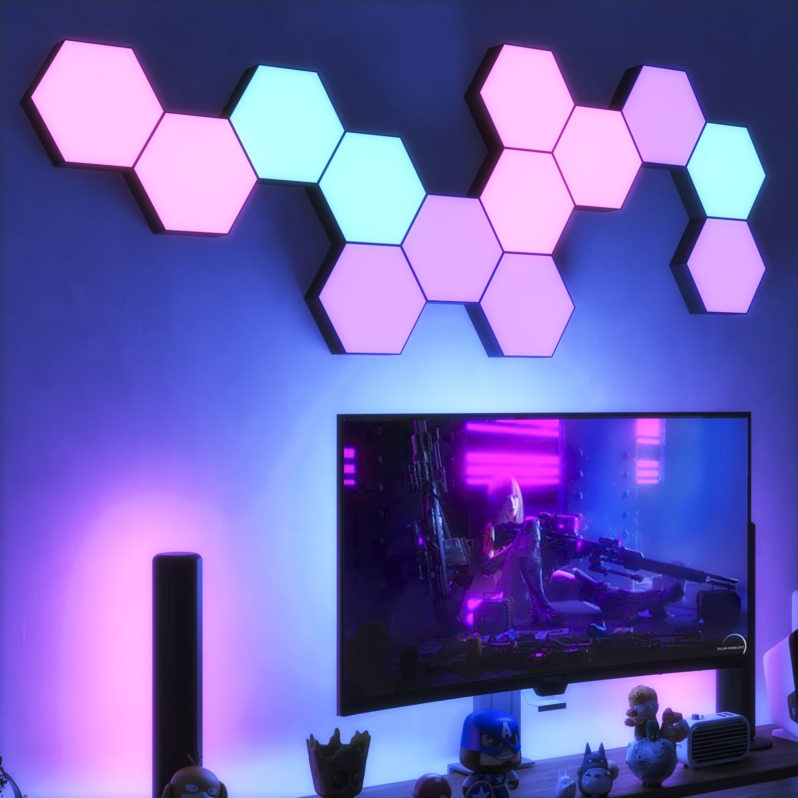
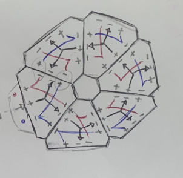
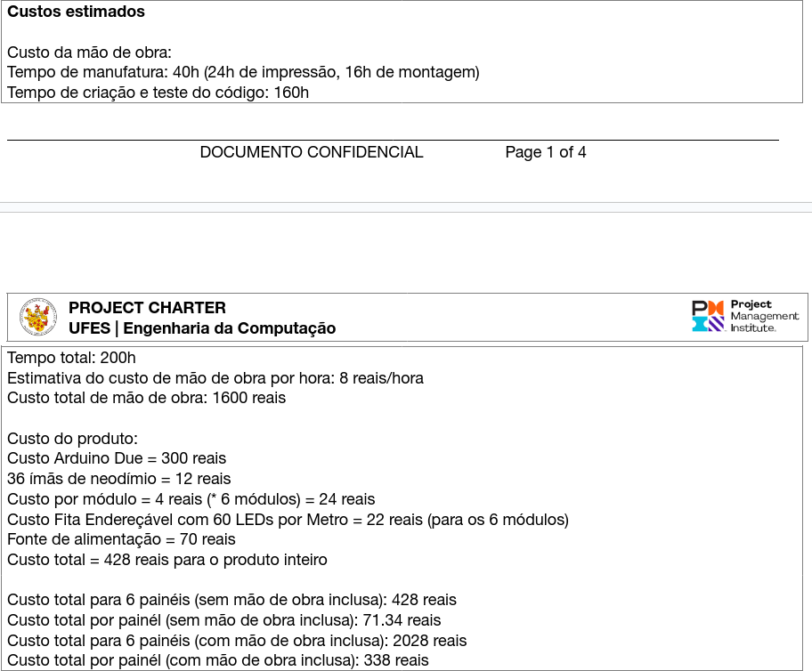

# FlexiLights

## 1. Introdução
**FlexiLights** é um produto de decoração que busca tornar ambientes mais
confortáveis e agradáveis ao público, não deixando de lado a praticidade no
seu uso. 

A ideia por trás dos painéis modulares de LED é de sincronizar com as imagens
que se passam em uma tela, de modo a exibir as cores dominantes ali presentes.

### 1.1 Objetivo
Esse projeto surgiu com objetivo de baratear uma solução já existente no
mercado e de simplifica-la, a fim de facilitar sua confecção e utilização.

*Exemplo de produto do mercado a ser barateado e simplificado*

### 1.2 Funcionamento
Existem três componentes principais para o funcionamento do produto proposto:
* Os painéis modulares de LED
* Um microcontrolador
> Arduino UNO, Arduino DUE, Arduino Nano, ESP32 e outros que suportem a
> biblioteca [FastLED](https://github.com/FastLED/FastLED)
* Um computador

Os painéis de led são controlados por um microcontrolador, que é responsável
por captar o sinal de controle enviado por um computador e acender
individualmente os painéis de LED. 

O computador, por sua vez, é responsável por executar o Software de captação e
processamento de alguma tela, que pode ser tanto a própria tela do computador
como a tela de uma televisão ou de outro display. Além da captação e
processamento do que se passa na tela, o sistema em questão também é
responsável por enviar o sinal de controle para o Arduino, que se encarrega
por decodifica-lo e controlar os painéis.

## 2. Desenvolvimento: Software

### 2.1 Requisitos
* [Prismatik](https://github.com/psieg/Lightpack)
* [Arduino IDE](https://www.arduino.cc/en/software) 
* [Biblioteca FastLED](https://github.com/FastLED/FastLED)

### 2.2 Configuração
Para que os painéis modulares de LED sejam acesos em sincronia com uma tela, é
necessário subir o código cliente para o Arduino e configurar o Software
Prismatik em um computador.

#### 2.2.1 Arduino
O código cliente do Arduino pode ser encontrado na pasta
`Software/Prismatik/Arduino/FlexiLights/` desse repositório, que deve ser
subido no Arduino por meio do programa **Arduino IDE**.

#### 2.2.2 Prismatik
Uma vez instalado, a primeira inicialização do Prismatik permitirá que o
usuário configure a tela que deverá ser monitorada pelo Software em execução.
Nesse processo, o Prismatik permite que o usuário defina e posicione um número
qualquer de regiões retangulares na tela a ser capturada. Cada uma dessas
regiões retangulares definidas será então utilizada para controlar um único
painel modular de LED. A exemplo, caso sejam utilizados 2 painéis de LED,
então essa etapa exigirá que o usuário crie e posicione ao menos duas regiões
retangulares na tela a serem utilizadas para controlar os painéis em questão.

### 2.3 Funcionamento
Existem dois programas que devem ser utilizados para que o produto funcione
corretamente. Um desses programas deve ser carregado e executado pelo
microcontrolador, enquanto o outro programa deve ser executado pelo
computador/host.

O programa executado pelo microcontrolador é responsável por receber o sinal
de controle enviado pelo computador por meio de algum canal de comunicação
(Serial, Bluetooth ou outro) e acender os painéis.

O código em questão foi escrito de forma a considerar que os painéis de LED
formam uma grande fita sequencial de LEDs. Nesse sentido, considera que a cada
9 LEDs dessa fita se tem um paínel de LED a ser controlado individualmente.

Já o programa executado pelo computador corresponde ao **Prismatik**, que é
responsável por:
1. capturar as imagens que se passam em regiões da tela
2. processar as imagens e gerar o sinal de controle dos leds
3. enviar o sinal de controle dos leds ao arduino por meio de um canal de
   comunicação, que pode ser a via serial do Arduino ou Bluetooth, o que
requer configuração adicional.
> O canal de comunicação utilizado nesse projeto entre o computador e o
> arduino foi o canal serial do Arduino UNO (USB-B).

A partir do momento em que o microcontrolador se encontra preparado e
funcional, o Prismatik passa a monitorar as regiões retangulares definidas
na tela e se encarrega de efetuar um algoritmo que calcula a média de cor
RGB presente nessa região. Uma vez calculada a cor média/dominante da região,
o software envia o sinal de controle para o Arduino, que decide como acender
os painéis a partir desse sinal.

## 3. Desenvolvimento: Hardware

### 3.1 Lista de materiais
* Fita Adalight WS2812
* Imas de neodímio
* Modelo de impressão de 3D do módulo
* Material para impressora 3D
* Solda

### 3.2 Confecção
A confecção de 1 módulo consiste em basicamente 4 etapas:
1. Impressão 3D do painel
2. Confecção da parte elétrica interna do módulo
3. Preparo dos encaixes com ímã de neodímio
4. Soldagem da parte elétrica aos ímas e aos leds

#### 3.2.1 Impressão 3D do painel
A impressão 3D de 1 módulo requer uma impressora 3D funcional e o arquivo de
modelo de um módulo. Para além disso, é necessário configurar corretamente a
impressora 3D e esperar que a impressão do módulo termine.

#### 3.2.2 Confecção da parte elétrica interna
O circuito elétrico interno utilizado nos módulos consiste em 3 canais, sendo
um para o sinal de controle, um para o positivo e outro para o negativo. Um
esboço do projeto eletrico segue ilustrado abaixo:

#### 3.2.3 Preparo dos encaixes com íma de neodímio
Os ímas de neodímio correspondem a uma das partes mais importantes do projeto,
pois esses conectores são responsável tanto por unir diferentes painéis como
por conduzir eletricamente o sinal de controle e da alimentação. Esses ímas
devem ser soldados juntos a algo metalico, como um prego que tenha os lados
lixados, para facilitar na pega da solda e também impedir com que os ímãs
percam o magnetismo.

#### 3.2.4 Soldagem da parte elétrica aos ímas
Uma vez que os encaixes com íma de neodímio e os circuitos elétricos estejam
prontos, chega a hora de posicionar também a fita de led no interior do
painel. Para isso, a fita de led deve ser seccionada em grupos de 3 em 3 LEDs.

Com os grupos de 3 LEDs em mãos, é necessário iniciar a solda dos circuitos
elétricos aos ímãs de neodímio (que nesse momento são posicionados nas
laterais do modulo) e também aos LEDs, que devem ser posicionados nas
entremidades internas do painel triangular, para que quando acesos se
assemelhem a imagem abaixo.

## 4. Desafios do projeto
Dentre algumas das decisões de projeto tomadas para tornar tanto a confecção
como a utilização desse produto mais simples, estão duas principais:
* Confecção de painéis com formato triangular em vez de hexagonal 
* Utilização de encaixes feitos com ímãs, em vez de cliques mecânicos.

A preferência pelo formato triangular sobre o hexagonal se deu pela forma como
o sinal de controle é transmitido entre os painéis de LED. Isso porque os
painéis de LED são compostos por 3 lados, sendo 1 de entrada e 2 de saída. A
partir do momento que os paineis são conectados entre si, é construida uma
topologia de painéis, que se torna cada vez mais complexa conforme o número de
painéis aumenta. Nesse sentido, caso fosse escolhido o formato hexagonal,
existiria um número ainda maior de possibilidades para o roteamento do sinal
de controle, o que dificultaria o design das entradas e saídas dos painéis,
bem como a confecção dos módulos no que tange a parte elétrica interna
presentes nesses.

Quanto a utilização de ímãs para o encaixe de painéis de LED em sucessão, esse
consiste em um dos diferenciais do nosso produto frente àqueles presentes no
mercado. No entanto, essa característica também foi responsável por levantar
dificuldades na confecção dos painéis, visto que corresponde a um ponto
importantíssimo para a transmissão do sinal elétrico entre os painéis. O
desafio se deu em grande parte em garantir um encaixe perfeito entre os
painéis, a partir de uma confecção puramente manual dos ímãs usados nesse
encaixe. Mais especificamente, os ímãs deveriam ficar perfeitamente alinhados
e com a altura correta para que o encaixe acontecesse com precisão, o que era
uma tarefa difícil de se efetuar dado que o encaixe foi confeccionado
manualmente e, portanto, sem padronização.

## 5. Conclusão
O flexilights é um produto que atingiu seu objetivo inicial em baratear o
custo da solução existente no mercado.

## 6. Referências
* [Especificações do Arduino Due](https://docs.arduino.cc/hardware/due/#features)
* [Como usar o arduino-cli](https://arduino.github.io/arduino-cli/0.34/getting-started/)
* [Referência completa da linguagem do arduino](https://www.arduino.cc/reference/en/)
* [Referência do módulo Serial](https://www.arduino.cc/reference/en/language/functions/communication/serial/)
* [Referência das bibliotecas padrão do arduino](https://www.arduino.cc/reference/en/libraries/)
* [Github do FastLED](https://github.com/FastLED/FastLED)
* [Função fill solid - Doc FastLED](https://fastled.io/docs/group___color_fills.html#gac0bcd5712f9f57a186f2c5f96911af1d)
* [Metodos da variavel global 'FastLED' - Doc FastLED](http://fastled.io/docs/class_c_fast_l_e_d.html)
